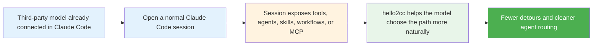

# hello2cc

[](https://www.npmjs.com/package/hello2cc)
[](./LICENSE)
[](https://github.com/hellowind777/hello2cc/actions/workflows/publish.yml)

Make third-party models work inside Claude Code as close to Opus as the plugin layer can drive them.

`hello2cc` does **not** replace your model gateway, provider mapping, or account permissions.  
Its job is simpler:

> If you already connected GPT, Kimi, DeepSeek, Gemini, Qwen, or other third-party models to Claude Code, `hello2cc` keeps pushing them toward Opus-compatible Claude Code behavior: native capability priorities, tool and agent choice, team/task workflow use, failure recovery, and output style.

**Language:** English | [简体中文](./README_CN.md)

---

## 🆕 What changed in 0.4.6

Compared with `0.4.5`, this patch release focuses on making current-info, web search, and multi-step execution align more closely with native Claude Code behavior:

| 0.4.6 change | What you should notice |
|---|---|
| Stronger current-info web search shaping | Compare-style prompts are more likely to start with short real searches instead of overloaded queries |
| Better `Did 0 searches` recovery | Failed or empty web-search turns are less likely to be mistaken for valid search results |
| Task tracking separated from team routing | Complex multi-step work is more likely to stay on task tracking unless true team collaboration is needed |
| More language-agnostic structural intent signals | Slash-pair comparisons and structured prompts are routed more reliably without depending on keyword matches |

---

## 🎯 Why use hello2cc?

| Common problem | What hello2cc improves |
|---|---|
| A matching skill or workflow already exists, but the model keeps rewriting the process | Encourages the model to continue with the surfaced or already-loaded workflow |
| The session already exposes MCP resources or tools, but the model still takes a detour | Nudges the model toward the most direct path first |
| Plain parallel workers get confused with team or teammate semantics | Reduces avoidable agent routing mistakes |
| The model can answer, but does not pick the right Claude Code capability | Pushes tool, agent, workflow, and MCP choice back toward native Claude Code priorities |
| The model depends too much on wording or keyword hints | Switches to language-agnostic semantic matching inside host-exposed candidate boundaries |
| The output style drifts away from native Opus | Forces a tighter Claude Code-native result style |
| The model drifts into verbose meta narration | Keeps responses closer to concise native Claude Code style |

---

## ✅ Best for / ❌ Not for

### ✅ Best for

- You already use Claude Code with third-party models through **CCSwitch** or another mapping layer
- You want those models to behave more like a native Claude Code session
- You have skills, workflows, MCP servers, or plugins installed and want them to be used more reliably
- You want parallel agent work to choose a more appropriate path

### ❌ Not for

- Setting up provider accounts, API keys, or gateway access
- Exposing tools that Claude Code did not expose in the first place
- Replacing **CCSwitch**
- Overriding higher-priority repository rules such as `CLAUDE.md`, `AGENTS.md`, or direct user instructions

---

## 📊 By the numbers

| Item | Value |
|---|---|
| Install flow | 3 steps |
| Extra command required after install | 0 |
| Common config profiles | 2 |
| Main goal | 1 — make third-party models behave more like native Claude Code / Opus sessions |

---

## ✨ What it helps with

<table>
<tr>
<td width="50%">

### Skills & workflows

Better continuity when a workflow is already visible or already in progress.

</td>
<td width="50%">

### Tools & MCP

Stronger preference for capabilities that are already available in the session.

</td>
</tr>
<tr>
<td width="50%">

### Agents & teams

Keeps one-shot parallel work on ordinary agent paths, while sustained collaboration is more likely to use a real team + task-board flow.

</td>
<td width="50%">

### Cleaner interaction

Less unnecessary meta narration and fewer avoidable routing mistakes.

</td>
</tr>
</table>

---

## 🚀 Quick start

### 1) Clone this repository

```bash
git clone https://github.com/hellowind777/hello2cc.git
cd hello2cc
```

### 2) Add the local marketplace

```bash
claude plugins marketplace add "<repo-path>"
```

Replace `<repo-path>` with your local `hello2cc` repository path.

### 3) Install the plugin

```bash
claude plugins install hello2cc@hello2cc-local
```

Then reopen Claude Code or run `/reload-plugins`.

### Expected result

- No extra manual entry point is required
- Installing the plugin does not write `agent=hello2cc:native` into Claude Code settings
- Plugin enablement stays under Claude Code's own plugin state, not a plugin-shipped `settings.json`
- Third-party models are more likely to use session-visible capabilities directly
- Ordinary parallel agents are less likely to be misrouted
- Team/subagent sessions are less likely to suffer from oversized injected context

---

## 🔧 Recommended configuration

### Option A — Keep the default strong alignment

Good when your model mapping is already handled by **CCSwitch** and you want hello2cc to stay on its default strong alignment path.

```json
{
  "mirror_session_model": true
}
```

### Option B — Set a stable default agent slot

Good when you want most agents to use the same Claude slot.

```json
{
  "mirror_session_model": true,
  "default_agent_model": "opus"
}
```

If your real target model is mapped through **CCSwitch**, keep the actual mapping there.  
In `hello2cc`, prefer stable Claude slot values such as `inherit`, `opus`, `sonnet`, or `haiku`.

### What 0.4.6 especially improves

- Shapes current-info and compare prompts into cleaner real-search steps first
- Recovers more safely when `WebSearch` returns `Did 0 searches`
- Uses task tracking for complex non-team work before fanning out plain agents
- Reduces keyword-dependent routing by leaning more on structural intent detection

---

## 🔧 How it fits into your workflow



---

## 🛠️ Reinstall / upgrade

If you changed the local repository or want a clean reinstall:

```bash
claude plugins uninstall --scope user hello2cc@hello2cc-local
claude plugins marketplace remove hello2cc-local
claude plugins marketplace add "<repo-path>"
claude plugins install hello2cc@hello2cc-local
```

Then reopen Claude Code or run `/reload-plugins`.

---

## 🛠️ Troubleshooting

### The plugin seems inactive

Try these in order:

1. Reopen Claude Code or run `/reload-plugins`
2. Confirm the plugin is installed and enabled
3. If you upgraded from a local clone, reinstall it cleanly

### `hello2cc:native` still shows after disable or `/reload`

That banner can persist in the current or resumed session because Claude Code keeps session agent state separately from plugin enablement.
Current `hello2cc` no longer ships a plugin-side `settings.json` to force `agent=hello2cc:native`, so a clean reinstall or a fresh session stops new unintended agent injection.

### The model still ignores a skill, tool, or MCP resource

Check whether:

1. That capability is actually exposed in the current session
2. A higher-priority project rule or user instruction is restricting it
3. You are continuing the same workflow instead of starting a different one

### Multiple plugins feel noisy together

Current versions no longer provide `sanitize-only` or another lightweight fallback mode.  
If several plugins are injecting guidance, keep one dominant behavior-alignment layer and disable or retune the conflicting plugins instead of weakening hello2cc into a thin shim.

### You still hit `summary is required when message is a string`

Update to the latest version, reload the session, and reinstall if needed.  
Recent versions add a compatibility layer for plain-text `SendMessage`.

### Current-info or compare tasks keep missing web results

Update to `0.4.6`, then reload the plugin cleanly.  
This version tightens short-query shaping and treats `Did 0 searches` as an empty search attempt instead of a successful result.

---

## ❓ FAQ

<details>
<summary><strong>Does hello2cc replace CCSwitch?</strong></summary>

No. Keep model mapping in CCSwitch. hello2cc focuses on what happens after the model is already running inside Claude Code.

</details>

<details>
<summary><strong>Does it enable tools that Claude Code did not expose?</strong></summary>

No. It only helps the model use capabilities that are already available in the current session.

</details>

<details>
<summary><strong>Do I need to switch an output style manually?</strong></summary>

Usually no. After installation, it should work without an extra manual entry point.

</details>

<details>
<summary><strong>Will installation force-select <code>hello2cc:native</code> for the current thread?</strong></summary>

No. The plugin ships the native agent as an available option, but it no longer injects a default `agent` setting into Claude Code.

</details>

<details>
<summary><strong>Will it block my existing skills, plugins, or MCP servers?</strong></summary>

No. The goal is the opposite: make those existing capabilities easier for third-party models to discover and use.

</details>

<details>
<summary><strong>Does every multi-agent task become a team?</strong></summary>

No. One-shot parallel work can stay on ordinary agent paths. More sustained collaboration is more likely to use a team flow.

</details>

<details>
<summary><strong>Do I need to set a default agent model?</strong></summary>

Only if you want a stable default Claude slot for most agents. If your mapping is already managed well elsewhere, you can keep the config minimal.

</details>

<details>
<summary><strong>Can I still switch hello2cc into a lightweight compatibility-only mode?</strong></summary>

No. The current direction keeps hello2cc as a default strong alignment layer instead of falling back to a thin sanitize-only shim.

</details>

---

## 📞 Support

- Issues: https://github.com/hellowind777/hello2cc/issues
- Releases: https://github.com/hellowind777/hello2cc/releases

---

## 📜 License

Apache-2.0
